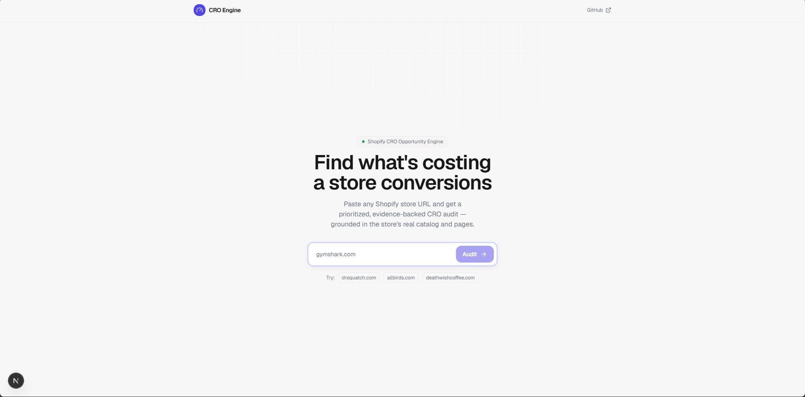
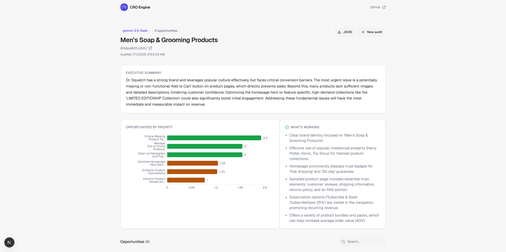

# Shopify CRO Opportunity Engine

[](https://github.com/RickyVishwakarma/shopify-CRO/actions/workflows/ci.yml)

**Live demo: [shopify-cro-eight.vercel.app](https://shopify-cro-eight.vercel.app)** · try a server-rendered store like `allbirds.com` or `drsquatch.com`.

Paste a Shopify store URL and get a prioritized, evidence-backed Conversion Rate Optimization audit. The recommendations come from an LLM working over the store's real catalog and page content, so they cite actual products and copy instead of handing back generic best-practice advice.

Think of it as the pre-call research a CRO consultant would do before pitching a store: walk in already knowing where conversions are leaking.

```
  https://gymshark.com  ->  scrape  ->  extract evidence  ->  LLM  ->  ranked audit
```

## Screenshots

|                             |                              |
| --------------------------- | ---------------------------- |
|  |  |

Example opportunity (abridged):

> **Surface social proof on product pages** · Priority 4.0
> Product pages show no review count above the fold, while the homepage hero claims "10M+ customers."
> Evidence: `PDP: Vital Seamless Leggings` → `product.reviews` is empty; homepage `.hero__subtitle` = "Trusted by 10M+ athletes".
> Impact 4/5 · Confidence 0.8 · Effort 2/5
> Experiment: add review stars and count near the Add-to-Cart button. Metric: PDP→cart conversion. Expected: +3–6%.

## Contents

- [What it does](#what-it-does)
- [Architecture](#architecture)
- [Engineering decisions](#engineering-decisions)
- [How a recommendation is produced](#how-a-recommendation-is-produced)
- [Tech stack](#tech-stack)
- [Project structure](#project-structure)
- [Running locally](#running-locally)
- [Environment variables](#environment-variables)
- [Testing](#testing)
- [Future work](#future-work)

## What it does

1. Validates and normalizes the submitted URL, and refuses private/internal hosts (SSRF-safe).
2. Scrapes the store: homepage, collections, and a sampled product page.
3. Extracts structured evidence: products, collections, hero copy, CTAs, trust badges, pricing, review signals, shipping/returns copy, FAQ, navigation, and image counts.
4. Sends that evidence to an LLM that must return JSON only and cite the exact page element behind every recommendation.
5. Ranks the opportunities by a priority score computed in our own code.
6. Renders a dashboard: executive summary, a priority chart, and a filterable list of opportunities with expandable reasoning and an A/B test brief on each.

Three things keep the output specific rather than generic:

- **Evidence-backed recommendations.** Every opportunity links to the scraped element or text that triggered it. No evidence, no claim.
- **Experiment briefs.** Each recommendation ships with a ready-to-run A/B test: hypothesis, metric, expected impact, effort, and an implementation note.
- **Executive summary.** A plain-language summary for a non-technical marketing manager, sitting on top of the detailed audit.

## Architecture

```
 Browser (Next.js client)
   │  POST /api/audits { url }
   ▼
 Route handler ── orchestrator.ts ─────────────────────────────────────┐
   │                                                                    │
   ├─► URL validation + SSRF guard ──────────► reject bad/private hosts │
   │                                                                    │
   ├─► Cache lookup (normalized URL) ─────────► hit? return cached      │
   │                                                                    │
   ├─► Scraper  (async, parallel, fault-tolerant)                       │
   │     ├─ Shopify JSON:  /products.json, /collections.json            │
   │     ├─ Homepage HTML  ─► cheerio parse (hero, CTAs, trust, nav)    │
   │     └─ Sample PDP HTML ─► cheerio parse (reviews, shipping, FAQ)   │
   │     └─ each call: timeout + retry + partial-failure tolerance      │
   │                                                                    │
   ├─► Normalize ─────────────────────────────► StoreEvidence (typed,   │
   │                                              token-bounded)         │
   ├─► LLM provider  (dependency-injected interface)                    │
   │     ├─ ClaudeProvider   strict JSON, zod validate, repair retry    │
   │     ├─ GeminiProvider   free tier, forced JSON, retry + backoff    │
   │     └─ TemplateProvider deterministic fallback, runs with no key   │
   │                                                                    │
   ├─► Grounding check ───────────────────────► flag cited evidence     │
   │                                              not found in the scrape│
   ├─► Scoring  (Impact × Confidence ÷ Effort, computed server-side)    │
   │                                                                    │
   └─► Persist to cache ──────────────────────► return Audit ───────────┘
```

Everything runs inside one Next.js app. There is no separate backend service (see the decisions below for why).

## Engineering decisions

The choices that mattered, and what each one gives up.

### Shopify JSON endpoints instead of a headless browser

Shopify stores expose `/products.json` and `/collections.json` as public, paginated JSON. The scraper reads those for catalog data and does a light HTML fetch + [cheerio](https://cheerio.js.org/) parse only for page chrome (hero, CTAs, trust badges, review widgets).

A headless browser like Playwright would be the wrong tool here. It adds a ~400 MB Chromium dependency, slow cold starts, and anti-bot fragility, and it buys nothing the JSON endpoints don't already give cleanly for a tool that reads three page types.

The tradeoff: stores that render entirely client-side, or that disable the JSON endpoints, won't fully parse. The app detects that case and reports what it couldn't read instead of inventing findings. At real scale the scraper would move to a queue + worker + headless browser, but that isn't worth it here.

### One Next.js app, not a separate Python/FastAPI backend

A single-purpose tool doesn't justify two services, two deploys, and the glue between them. Next.js route handlers do the async orchestration fine, and a reviewer can clone and run it with one command.

The tradeoff: scraping shares the request lifecycle. If this became a real product, the scrape-and-analyze step would move to a background job that the client polls by id. For now the client shows staged progress messages while the request runs, so the wait isn't a dead spinner.

### The LLM sits behind a provider interface with a deterministic fallback

`LLMProvider` is an interface with three implementations, tried in order:

- `ClaudeProvider` — Anthropic API, structured-output (JSON-schema) mode.
- `GeminiProvider` — Google Gemini (free tier), forced JSON output. A no-cost way to run the real model path.
- `TemplateProvider` — a rule-based generator that produces a valid, if shallower, audit with no API key at all.

`analyzeStore` uses the first configured provider (Claude if `ANTHROPIC_API_KEY` is set, otherwise Gemini if `GEMINI_API_KEY` is set) and falls through to the next, and finally to the template, on any failure. So the app runs and demos even with no key, and it degrades instead of failing outright. The template output is a safety net and a test seam, not a replacement for the model.

### The model's output is never trusted blindly

Three checks sit between the LLM and the user:

1. **Schema validation.** The response is constrained to a JSON schema and re-validated with [zod](https://zod.dev/) server-side. One automatic repair retry on malformed output, then graceful degradation.
2. **Server-side scoring.** `priorityScore` is recomputed from impact/confidence/effort in our code, never read from the model, so the model can't influence the ranking.
3. **Grounding check.** Each cited excerpt is compared against the scraped data by word overlap; anything that can't be matched is flagged rather than shown as fact. This catches hallucinated citations programmatically.

### Next.js 16, not the brief's "15"

The brief named Next.js 15; `create-next-app` installed 16, the current stable. Both use the App Router this project relies on, so pinning back would only forgo current fixes.

### Left out of v1 on purpose

User accounts, a historical-audit database, client-rendered theme scraping, and PDF export are not built (JSON export ships instead). They're listed under [Future work](#future-work).

## How a recommendation is produced

```
scraped data -> normalize to StoreEvidence -> prompt (system + evidence + schema)
   -> model (JSON output) -> zod validate -> grounding check
   -> recompute priority -> sort -> render
```

Priority score:

```
priority = (impact × confidence) ÷ effort
           impact:     1–5   (business upside if fixed)
           confidence: 0–1   (how sure we are it's a real problem)
           effort:     1–5   (implementation cost; floored at 1)
```

High-impact, high-confidence, low-effort items rise to the top, which is roughly how a consultant decides what to tackle first.

The system prompt casts the model as a senior Shopify CRO consultant with hard rules: output JSON only, cite supplied evidence on every opportunity, never invent products or copy, and mark absent data as `missing` rather than guessing. Full text is in [`lib/prompts/`](lib/prompts).

## Tech stack

| Layer | Choice |
|---|---|
| Framework | Next.js 16 (App Router) + React 19 |
| Language | TypeScript (strict) |
| Styling | Tailwind CSS v4, with small hand-built UI components (shadcn-style) |
| Scraping | Shopify public JSON + `cheerio` |
| LLM | Anthropic Claude or Google Gemini, behind a provider interface, with a deterministic fallback |
| Validation | `zod` |
| Charts | `recharts` |
| Tests | `vitest` |
| Deploy | Vercel (single project) |

## Project structure

```
cro-engine/
├─ app/
│  ├─ page.tsx                      # landing: URL input + staged loading
│  ├─ audit/[id]/page.tsx           # audit dashboard
│  └─ api/audits/
│     ├─ route.ts                   # POST: run (or return cached) audit
│     └─ [id]/route.ts              # GET: fetch an audit by id
├─ lib/
│  ├─ validation/url.ts             # normalize + SSRF guard
│  ├─ scraper/                      # fetcher, shopify (JSON), parseHtml, index
│  ├─ analysis/scoring.ts           # priority score + grounding check
│  ├─ llm/                          # provider, claude, gemini, template, validate, index
│  ├─ prompts/                      # system.ts, user.ts
│  ├─ cache/                        # store interface + in-memory implementation
│  └─ orchestrator.ts               # validate -> scrape -> analyze -> score -> cache
├─ components/
│  ├─ Header.tsx
│  ├─ ui/                           # badge, button, card, input
│  └─ audit/                        # dashboard, cards, chart, evidence links, filters
├─ types/audit.ts                   # zod schemas + inferred types (single source of truth)
└─ tests/                           # url, scoring, llm, cache, api
```

## Running locally

```bash
npm install
cp .env.example .env.local     # add an LLM key (optional — see below)
npm run dev                    # http://localhost:3000
```

Open the app, paste a Shopify store URL (a server-rendered store like `allbirds.com` gives the richest result), and run an audit.

Without a key the app still runs on the deterministic fallback and labels the result as such. Set `GEMINI_API_KEY` (free) or `ANTHROPIC_API_KEY` for full model-driven audits.

## Environment variables

| Variable | Required | Description |
|---|---|---|
| `GEMINI_API_KEY` | No* | Google Gemini key. Free to obtain at [aistudio.google.com/apikey](https://aistudio.google.com/apikey). |
| `GEMINI_MODEL` | No | Gemini model id (default `gemini-2.5-flash`). |
| `ANTHROPIC_API_KEY` | No* | Anthropic Claude key from [platform.claude.com](https://platform.claude.com). Takes priority over Gemini when both are set. |
| `LLM_MODEL` | No | Claude model id (default `claude-opus-4-8`; e.g. `claude-haiku-4-5` to cut cost). |
| `MAX_PRODUCTS` | No | Cap on products sampled per audit; controls token cost and latency. |

\* Neither key is required to run. With no key set the app uses the deterministic fallback; set either key for real model output.

## Testing

```bash
npm test
```

The suite (`vitest`) covers the parts where correctness matters most in a time-boxed build:

- URL validation and SSRF rejection
- the priority-scoring math and grounding logic
- audit schema validation, repair parsing, and the deterministic template
- the `/api/audits` route: success plus the error responses (400 / 422)

CI runs lint, typecheck, tests, and a production build on every push (see `.github/workflows/ci.yml`).

## Future work

- Background job + worker so scrape/analyze runs outside the request lifecycle.
- Headless-browser fallback for fully client-rendered themes.
- Competitor comparison: audit two stores and diff the opportunities.
- Persisted audits and change tracking (the cache layer is already an interface, so a Supabase-backed store drops in).
- PDF export.
- Auth and multi-tenant workspaces.
